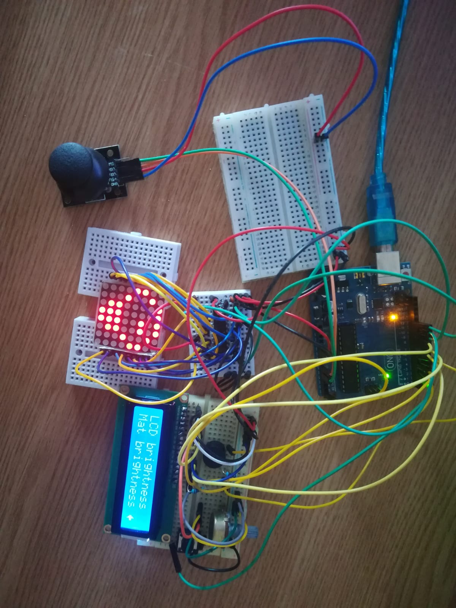

# LedMatrixGame

Task requirements 🏗️

 
  Using an lcd display, 8x8 led matrix, a joystick and a button create a mini game and a menu for it.

Game idea 🎮️

 
  Initially I tought about creating an endless runner similar to geometry dash but I realised jumping and moving background wouldn't feel so nice on a   matrix so as inspiration I have chosen space invaders. Since I wanted to make it original in some ways i made the game such that the player can't shot the enemies and just has to dodge and survive as much as possible.

Implementation 🧑‍💻️

 
  I created a dodge mini game: there are 4 enemies, one on each side of the matrix, moving on its own side from one corner to the other. From time to time a random enemy will shoot a bullet. The player can move using the joystick and has to survive, dodging the bullet and the enemies, for as long as possible. 
  Further you go into the game, faster the bullets move and enemies will start to shot up to 4 bullets at a time.

  For the menu I created multiple stages:
  1) When game starts a greeting message will appear for few secons
  2) After that, the main menu will appear, with multiple options

      -start game

      -leaderboard

      -setting

      -how to play

      -credits

      a) start game will display a screen where player can choose a name and then press the button to start the game

      b) ledearboard will display top 5 scores

      c) settings will display few options: choose game difficulty, sounds settings, reset leaderboard, matrix brightness, lcd brightness and contrast

      d) how to play will list game commands and tips

      e) credits will display the author and the github where people can find the project

  3) During the game the lcd displays player name, score and hearts and the actual game runs on matrix
  4) When player loses the game is paused and the lcd displays player's name and score, adding it to the leaderboard if needed.

  Settings such as matrix brightness and lcd brightness or leaderboard are saved in EEPROM.

Showcase 📸️

 
Setup photo

    

Video link: https://drive.google.com/file/d/1u10tr5Iw1ubGaUx9A8igSYLICWKHucXJ/view?usp=share_link

